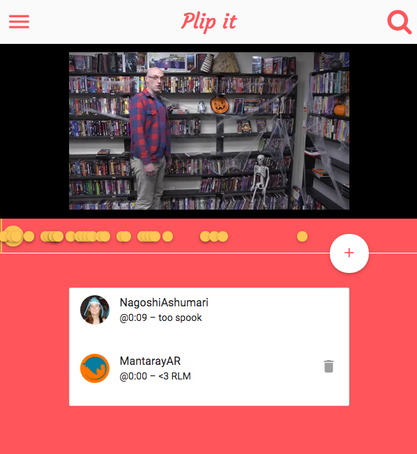

Plip it
=======

[](http://waffle.io/MantarayAR/plip-it)

Chat on videos. Your messages are automatically timestamped to where you initially wanted to post them!

[Visit the Live Website!](http://plipit.meteor.com)

[](http://plipit.meteor.com)


## Running the app

This is a Meteor application. You can run this application using:

```sh
cd src
meteor --setting settings.json
```


## Settings

A `settings.example.json` file is in `/src/` as an example of what your `settings.json` file should look like. You will need to add your own Twitter API tokens in order to get Twitter logins to work. You will also need a Youtube API token.


# Deployment

A `settings.prod.json` file is recommended to have when deploying to production, in order to keep your development and production settings separate.

Deploy using:

```sh
cd src
meteor deploy --settings settings.prod.json plipit.meteor.com
```
